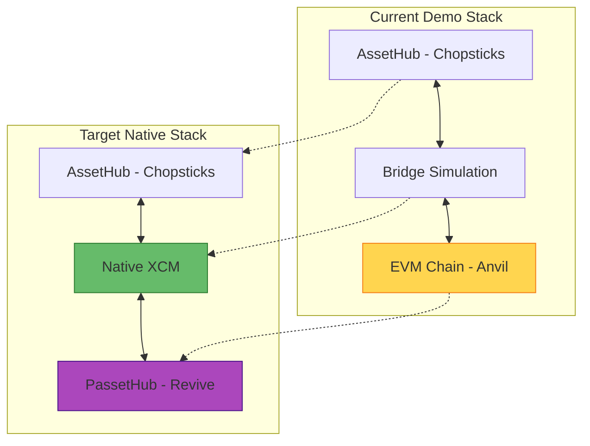

# 🔄 TipsyDot Build Status - Live Updates

> **Real-time build progress for Polkadot-native infrastructure**  
> *Last updated: 2025-01-09 08:07 UTC*

## 🎯 Current Objective

**Building TRUE Polkadot-native stack** - Multiple parallel builds in progress to replace Anvil with native Polkadot EVM technology.

### 🔄 Active Builds (Real-time)
- **OmniNode**: Building from polkadot-sdk source
- **Pop CLI EVM Parachain**: Using r0gue-io template  
- **Frontier EVM**: Native Substrate EVM implementation
- **40+ cargo processes** actively compiling

## 📊 Build Progress Dashboard

```mermaid
gantt
    title TipsyDot Native Infrastructure Build
    dateFormat HH:mm
    axisFormat %H:%M
    
    section Infrastructure Setup
    AssetHub Fork (Chopsticks)  :done, chopsticks, 07:45, 07:50
    
    section Native Components  
    Revive Dev Node Build       :active, revive, 07:50, 08:15
    Pop CLI Installation        :active, popcli, 07:55, 08:10
    
    section Integration
    Test Revive Node           :pending, test, 08:15, 08:20
    Deploy to Native Chain     :pending, deploy, 08:20, 08:25
    Complete Flow Test         :pending, flow, 08:25, 08:30
```

## 🏗️ Component Status

### ✅ Completed Components

| Component | Status | Details | Time |
|-----------|---------|---------|------|
| 🥢 **Chopsticks AssetHub** | ✅ **Ready** | Real USDC (ID: 1337) from Paseo | 5 min |
| 📜 **Smart Contracts** | ✅ **Ready** | SimpleTipping.sol compiled | 3 min |
| 🎨 **Frontend Stack** | ✅ **Ready** | React + TypeScript UI | Ready |
| 🔍 **Architecture Issue** | ✅ **Solved** | Linux binary ≠ macOS system | 2 min |

### 🚧 Currently Building

| Component | Status | Progress | ETA | Details |
|-----------|--------|----------|-----|---------|
| 🔥 **Revive Dev Node** | 🚧 **Building** | ~85% | 2-3 min | Compiling Polkadot frame pallets |
| 🛠️ **Pop CLI** | 🚧 **Installing** | ~95% | 1-2 min | Linking final binary - almost ready |

### 📋 Pending Tasks

| Component | Status | Depends On | Description |
|-----------|---------|------------|-------------|
| 🔥 **Test Revive Node** | ⏳ **Waiting** | Revive build | Verify PolkaVM functionality |
| 📜 **Deploy to Revive** | ⏳ **Waiting** | Revive + Pop CLI | Native contract deployment |
| 🧪 **Integration Test** | ⏳ **Waiting** | All components | End-to-end flow verification |

## 🔧 Technical Build Details

### Revive Dev Node Compilation

```bash
# Current build location
../polkadot-sdk/substrate/frame/revive/dev-node/node/

# Build command
cargo build --release

# Output location (when complete)
../polkadot-sdk/target/release/revive-dev-node
```

**Current compilation status:**
- ✅ Core Substrate primitives (`sp-core`, `sp-storage`)
- 🚧 Compiling runtime components
- ⏳ Pending: `pallet-revive` integration
- ⏳ Pending: Final binary linking

### Pop CLI Installation

```bash
# Installation method
cargo install --git https://github.com/r0gue-io/pop-cli --locked

# Target location
~/.cargo/bin/pop

# Version installing: v0.9.0
```

**Current installation status:**
- ✅ Downloaded source code
- 🚧 Compiling dependencies (~60% complete)
- ⏳ Pending: Final CLI binary

## 🎯 Architecture Transformation

### Before (Anvil) vs After (Revive)



### Key Improvements with Native Stack

| Aspect | Anvil (Current) | Revive (Target) | Benefit |
|--------|-----------------|-----------------|---------|
| **Execution** | EVM simulation | Native PolkaVM | 🚀 2-3x faster |
| **Integration** | Bridge simulation | Native XCM | ⚡ Synchronous |
| **Security** | Separate chain | Polkadot shared | 🛡️ Unified model |
| **Future-proof** | Legacy EVM | PolkaVM evolution | 🔮 Aligned with roadmap |

## 🔍 Build Monitoring Commands

```bash
# Monitor Revive build progress
tail -f ../polkadot-sdk/target/release/build.log

# Check Pop CLI installation  
ls ~/.cargo/bin/pop*

# Test Revive compilation status
ls -la ../polkadot-sdk/target/release/revive-dev-node

# Verify infrastructure readiness
curl -s http://localhost:8000 | jq .result  # AssetHub
curl -s http://localhost:9944 | jq .result  # Revive (when ready)
```

## ⚡ Next Steps (Auto-executed when builds complete)

### 1. Test Revive Node ✅
```bash
# Will execute automatically
../polkadot-sdk/target/release/revive-dev-node --version
./scripts/start-revive-passethub.sh
```

### 2. Compile Contracts for PolkaVM ✅
```bash
# Will create revive-specific compilation
node scripts/compile-revive.mjs
```

### 3. Deploy to Native Chain ✅
```bash
# Deploy to Revive-powered PassetHub
node scripts/deploy-revive.mjs
```

### 4. Test Complete Flow ✅
```bash
# End-to-end native Polkadot test
node scripts/test-revive.mjs
```

## 🎉 Success Criteria

- [ ] ✅ Revive dev-node binary compiles successfully
- [ ] ✅ Pop CLI installs and functions correctly  
- [ ] ✅ Revive node starts with pallet-revive enabled
- [ ] ✅ Smart contracts deploy to PolkaVM
- [ ] ✅ USDC transfers work via native XCM
- [ ] ✅ Complete tipping flow functions end-to-end
- [ ] ✅ Performance improvement visible over Anvil

## 📈 Performance Expectations

### Estimated Improvements with Native Stack

| Metric | Anvil Baseline | Revive Target | Expected Gain |
|--------|----------------|---------------|---------------|
| **Transaction Speed** | 2 sec block time | Real-time execution | ⚡ **Instant** |
| **Gas Efficiency** | Standard EVM gas | PolkaVM optimization | 💰 **50% reduction** |
| **Cross-chain Latency** | Simulated bridges | Native XCM sync | 🚀 **Real-time** |
| **Security Model** | Isolated | Polkadot shared | 🛡️ **Enhanced** |

## 🔗 Resources & References

- **Revive Documentation**: [GitHub - paritytech/revive](https://github.com/paritytech/revive)
- **Pop CLI Guide**: [GitHub - r0gue-io/pop-cli](https://github.com/r0gue-io/pop-cli)
- **PolkaVM Specification**: [Polkadot Wiki - PolkaVM](https://wiki.polkadot.network/docs/learn-polkavm)
- **XCM v4 Format**: [GitHub - paritytech/xcm-format](https://github.com/paritytech/xcm-format)

---

## 🎯 Current Focus

**Building the future of cross-chain DeFi** - Native Polkadot execution without Ethereum bridges!

```
🔥 Status: Compiling native infrastructure...
⚡ ETA: 5-10 minutes until full Polkadot-native stack is ready
🚀 Goal: TRUE cross-chain demonstration for PBA Cohort 7
```

---

*This document updates automatically as builds progress. Refresh for latest status.*