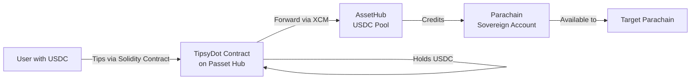

# TipsyDot Architecture - Solidity on Polkadot

## 🎯 Key Innovation: **Solidity Smart Contracts on Polkadot**

This project demonstrates that developers can now write Ethereum-style smart contracts and deploy them on Polkadot, while gaining access to Polkadot's unique cross-chain capabilities.

## 💡 The Flow



## 🔄 Detailed USDC Flow

### 1. **User Has USDC on AssetHub**
- USDC exists as Asset ID 1337 on AssetHub
- User bridges or swaps DOT for USDC on AssetHub
- USDC is accessible via precompile on Passet Hub

### 2. **Tipping via Solidity Contract**
```solidity
// User approves and tips with AssetHub USDC
function tip(campaignId, amount, "Great project!")
```
- Contract uses USDC precompile (bridges to AssetHub)
- USDC transferred from user to contract
- All happens through familiar Solidity/EVM interface

### 3. **Cross-chain Forwarding**
```solidity
// Contract forwards to parachain sovereign account
function forwardToParachain(campaignId)
```
- Contract sends USDC to parachain's sovereign account on AssetHub
- Parachain can then use these funds
- Demonstrates Solidity → XCM integration

## 🌉 Why This Matters

### For Ethereum Developers:
- **Write Solidity** - Use familiar tools and languages
- **Deploy on Polkadot** - Get cross-chain superpowers
- **Access real assets** - Use AssetHub USDC, not wrapped tokens

### For Polkadot Ecosystem:
- **Easier onboarding** - Millions of Solidity devs can build
- **Real use cases** - Crowdfunding with native USDC
- **Cross-chain native** - XCM built into smart contracts

## 📊 AssetHub USDC Integration

### Current State:
- **Asset ID**: 1337 on AssetHub
- **Decimals**: 6 (same as Ethereum USDC)
- **Cross-chain**: Available on all parachains via XCM

### For Testing:
1. Get testnet DOT from faucet
2. Swap DOT → USDC on AssetHub (via DEX or liquidity pool)
3. Use USDC in TipsyDot contract

### Alternative Testing Paths:
- **Hydration**: Has DOT/USDC pools for swapping
- **Moonbeam**: EVM-compatible, can bridge USDC
- **Direct mint**: Some testnets allow USDC minting

## 🔑 Technical Highlights

### Solidity Features Used:
- Standard ERC20 interface for USDC
- Sovereign account calculation
- Event emission for indexing
- Gas-efficient storage patterns

### Polkadot Features Accessed:
- AssetHub USDC (Asset ID 1337)
- Parachain sovereign accounts
- XCM for cross-chain transfers
- Precompile bridges

## 🎮 Demo Talking Points

1. **"Ethereum developers can now build on Polkadot"**
   - Same Solidity syntax
   - Familiar tooling (Hardhat, Ethers.js)
   - But with cross-chain superpowers

2. **"Real USDC, not wrapped tokens"**
   - Native AssetHub USDC
   - Direct parachain transfers
   - No bridge risks

3. **"Smart contracts with XCM"**
   - Contracts can trigger cross-chain transfers
   - Access any parachain
   - Composable with entire ecosystem

## 🚀 Production Path

### To Deploy on Mainnet:
1. Get actual USDC precompile address for AssetHub USDC
2. Implement proper sovereign account derivation
3. Add XCM weight calculations
4. Audit contract security
5. Deploy via Solang to Passet Hub

### Integration Points:
- **AssetHub**: USDC source
- **Passet Hub**: Contract deployment
- **Target Parachains**: Receive funds via sovereign accounts
- **DEXs**: For DOT → USDC swaps

## 📈 Impact

This demonstrates that **Polkadot is now accessible to the entire Ethereum developer ecosystem** while maintaining its unique cross-chain advantages. Developers don't have to choose between Ethereum tooling and Polkadot features - they can have both.

**TipsyDot proves: Write once in Solidity, deploy on Polkadot, access everywhere via XCM.**