# TipsyDot Economics - Sustainable Parachain Operations

## 💰 The Protocol Fee Model

TipsyDot takes a **0.1% protocol fee** on all tips to cover parachain coretime costs on Polkadot.

### Why This Matters:
- **Parachains need coretime** to operate on Polkadot
- **Coretime costs DOT** (purchased on-demand or bulk)
- **Protocol fees ensure sustainability** without VCs or token sales

## 📊 Fee Breakdown

For a 1000 USDC tip:
```
Gross Amount:     1000.00 USDC
Protocol Fee:        1.00 USDC (0.1%)
Net to Campaign:   999.00 USDC
```

## 🔄 The Sustainable Cycle

```mermaid
graph TD
    U[Users Tip Campaigns] -->|0.1% fee| PF[Protocol Fees Pool]
    PF -->|Convert USDC→DOT| DOT[DOT for Coretime]
    DOT -->|Purchase| CT[Coretime on Polkadot]
    CT -->|Enables| P[TipsyDot Parachain]
    P -->|Serves| U
```



## 💡 Real Numbers Example

### Monthly Activity Projection:
- **Total Tips Volume**: 1,000,000 USDC/month
- **Protocol Fees (0.1%)**: 1,000 USDC/month
- **Coretime Cost**: ~800 USDC/month
- **Surplus for Development**: 200 USDC/month

### Break-even Point:
- Need **800,000 USDC** monthly volume to cover coretime
- That's ~27,000 USDC daily tips
- Achievable with 100 active campaigns

## 🎯 Why 0.1%?

We chose 0.1% because:
- **Lower than traditional platforms** (GoFundMe: 2.9%, Kickstarter: 5%)
- **Covers coretime costs** at reasonable volume
- **Minimal impact on campaigns** (999 out of 1000 USDC still goes through)
- **Transparent and predictable**

## 🚀 Scaling Economics

As TipsyDot grows:

### Phase 1: Bootstrap (Current)
- Volume: 100K USDC/month
- Fees: 100 USDC/month
- Status: Partially subsidized

### Phase 2: Self-Sustaining
- Volume: 1M USDC/month
- Fees: 1,000 USDC/month
- Status: Fully covers coretime

### Phase 3: Growth
- Volume: 10M USDC/month
- Fees: 10,000 USDC/month
- Status: Funds development & features

## 🔧 Technical Implementation

```solidity
// Calculate protocol fee (0.1%)
uint256 protocolFee = (_amount * PROTOCOL_FEE_BPS) / BPS_DENOMINATOR;
uint256 netAmount = _amount - protocolFee;

// Track for coretime funding
protocolFeesBalance += protocolFee;
```

## 🌟 Benefits for Users

1. **No Hidden Fees**: Clear 0.1% on all tips
2. **Sustainable Platform**: Not reliant on VC funding
3. **Aligned Incentives**: We succeed when campaigns succeed
4. **Transparent Treasury**: On-chain fee tracking

## 🏛️ Governance Future

Protocol fees could eventually be governed by:
- **Campaign creators**: Vote on fee adjustments
- **Active tippers**: Influence treasury spending
- **Parachain token holders**: If we launch a token

## 📈 Coretime Strategy

### Bulk Coretime Purchase:
- Buy 6 months upfront for discount
- Cost: ~5,000 DOT
- Saves: 20% vs on-demand

### On-Demand Backup:
- For unexpected traffic spikes
- Pay-as-you-go model
- Ensures 100% uptime

## 💎 Value Proposition

**For Campaign Creators**:
- 99.9% of funds reach destination
- Much better than Web2 alternatives

**For TipsyDot**:
- Sustainable business model
- No token required
- Pure utility focus

**For Polkadot Ecosystem**:
- Demonstrates viable parachain economics
- Shows Solidity contracts can be profitable
- Attracts more builders

## 🔮 Future Optimizations

1. **Dynamic Fees**: Adjust based on coretime costs
2. **Fee Holidays**: 0% fees for special causes
3. **Bulk Discounts**: Lower fees for large tips
4. **Staking Rewards**: Share coretime staking yields

## 📊 Dashboard Metrics

The contract tracks:
- `totalProtocolFeesCollected`: Lifetime fees
- `protocolFeesBalance`: Available for coretime
- `estimatedCoretimeDays`: How long we can run

```solidity
function getProtocolFeeStats() returns (
    uint256 totalCollected,    // 50,000 USDC
    uint256 currentBalance,    // 5,000 USDC
    uint256 feePercentage,     // 10 (0.1%)
    uint256 estimatedDays      // 50 days
)
```

## 🎓 Educational Value

This demonstrates:
1. **Parachain sustainability** without tokens
2. **Real utility driving economics**
3. **Transparent on-chain accounting**
4. **Solidity contracts funding Substrate chains**

---

**TipsyDot: Where 0.1% keeps the lights on, and 99.9% changes the world!** 🌍